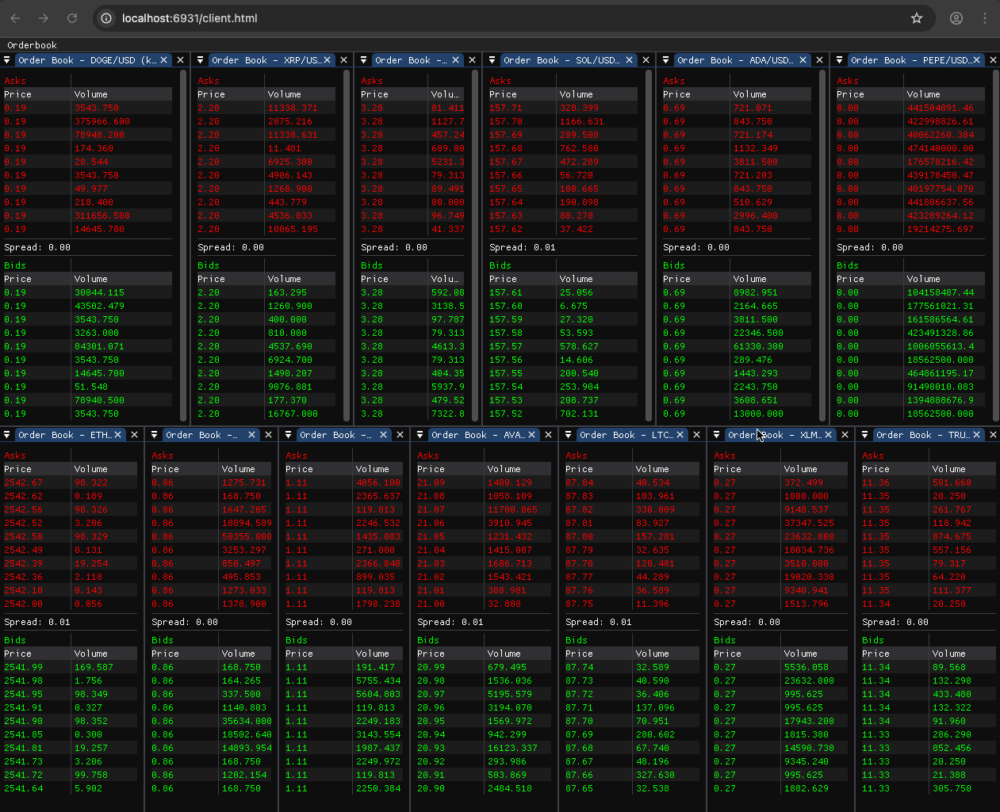
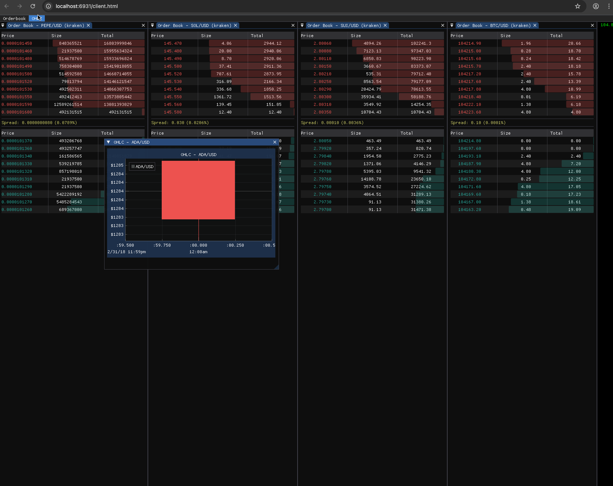
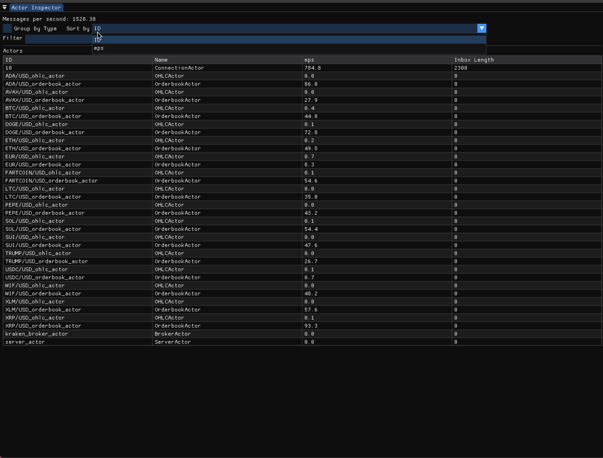

# Zigma: Actor-Based Algorithmic Trading Framework

## Overview

Zigma is an algorithmic trading framework built with the Zig programming language, leveraging an actor-based concurrency model. This project serves as both a practical trading system and an educational exploration of Zig's memory management capabilities and concurrency patterns.

## Goals

• Implement a robust actor framework for handling concurrent trading operations \
• Explore Zig's memory management features in depth \
• Develop efficient, low-latency trading algorithms \
• Create a modular system that can be extended with new strategies and market connectors \
• Serve as a learning resource for Zig programming best practices

## Architecture

Zigma is built around an actor model, where independent components communicate through message passing:

### Server (Zig)

• Market Data Actors – Connect to exchanges and process incoming market data \
• Strategy Actors – Implement trading algorithms and generate signals \
• Order Management Actors – Handle order creation, modification, and cancellation \
• Risk Management Actors – Monitor positions and enforce trading limits \
• Persistence Actors – Handle data storage and retrieval \
• WebSocket Server – Provides real-time data streaming to clients via non-blocking WebSocket connections

### Client (WASM)

• WASM Application – Runs entirely in the browser for real-time market data visualization \
• Web Workers – Handle WebSocket connections in separate threads for non-blocking data fetching \
• Real-time UI – Interactive orderbook visualization with ImGui-based interface

## Features

### Server

• Non-blocking, concurrent processing of market data \
• Memory-efficient implementation with minimal allocations \
• Type-safe message passing between actors \
• WebSocket-based client communication \
• Pluggable strategy system for implementing various trading algorithms \
• Comprehensive logging and monitoring \
• Provides real-time visibility into the actor system through an "Inspector" graphical interface

### Client

• WASM-based client application for cross-platform compatibility \
• Non-blocking data fetching using WASM Web Workers \
• Real-time WebSocket communication with the server \
• Interactive orderbook windows with live market data \
• Responsive UI that doesn't block on network operations

## Learning Outcomes

This project provides hands-on experience with: \
• Zig's comptime features and metaprogramming \
• Manual memory management with allocators \
• Error handling patterns in Zig \
• Concurrency without shared state \
• Performance optimization techniques \
• Safe interoperability with C libraries \
• WebAssembly compilation and deployment \
• Web Workers for non-blocking browser applications \
• WebSocket protocol implementation and optimization

## Getting Started

(Instructions for building and running the project will be added as development progresses.)

## Project Status

🚧 Early Development – The actor framework and core components are currently being designed and implemented.
